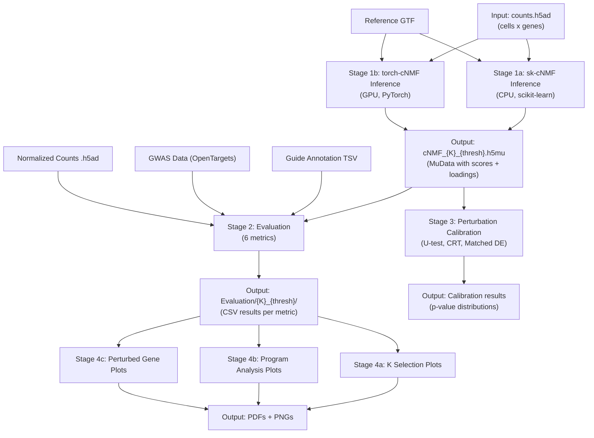

# Pipeline Evaluation Report: cNMF_benchmarking

**Generated**: 2026-03-08
**Pipeline path**: `/oak/stanford/groups/engreitz/Users/ymo/Tools/PerturbNMF`
**Analysis type**: Static code analysis + parameter discovery (SLURM tests pending submission)

## Pipeline Structure



### Stages

#### Stage 1a: sk-cNMF Inference (CPU)
- **Script**: `Stage1_Inference/sk-cNMF/Slurm_Version/sk-cNMF_batch_inference_pipeline.py`
- **Conda env**: `sk-cNMF`
- **SLURM resources**: 786G memory, 10 CPUs, 14 hours, no GPU
- **Parameters**: 21 total

| Parameter | Type | Default | Required |
|-----------|------|---------|----------|
| `--counts_fn` | str | - | Yes |
| `--output_directory` | str | - | Yes |
| `--run_name` | str | - | Yes |
| `--species` | str | - | Yes |
| `--K` | int list | [30,50,60,80,100,200,250,300] | No |
| `--numiter` | int | 10 | No |
| `--numhvgenes` | int | 5451 | No |
| `--seed` | int | 14 | No |
| `--init` | str | random | No |
| `--loss` | str | frobenius | No |
| `--algo` | str | mu | No |
| `--max_NMF_iter` | int | 500 | No |
| `--tol` | float | **1e4 (BUG)** | No |
| `--sel_thresh` | float list | [2.0] | No |
| `--run_factorize` | flag | False | No |
| `--run_refit` | flag | False | No |
| `--run_complie_annotation` | flag | False | No |
| `--check_format` | flag | False | No |
| `--parallel_running` | flag | False | No |

#### Stage 1b: torch-cNMF Inference (GPU)
- **Script**: `Stage1_Inference/torch-cNMF/Slurm_Version/torch-cNMF_inference_pipeline.py`
- **Conda env**: `torch-cNMF`
- **SLURM resources**: 96G memory, 10 CPUs, 5 hours, 1 GPU
- **Parameters**: 33 total (21 shared with sk-cNMF + 12 GPU-specific)

Additional parameters: `--mode`, `--use_gpu`, `--fp_precision`, `--alpha_usage`, `--alpha_spectra`, `--l1_ratio_usage`, `--l1_ratio_spectra`, `--online_usage_tol`, `--online_spectra_tol`, `--batch_max_iter`, `--batch_hals_tol`, `--batch_hals_max_iter`, `--online_max_pass`, `--online_chunk_size`, `--online_chunk_max_iter`, `--shuffle_cells`, `--sk_cd_refit`, `--remove_noncoding`, `--densify`

#### Stage 2: Evaluation
- **Script**: `Stage2_Evaluation/A_Metrics/Slurm_Version/cNMF_evaluation_pipeline.py`
- **Conda env**: `NMF_Benchmarking`
- **SLURM resources**: 96G memory, 20 CPUs, 5 hours
- **Parameters**: 22 total
- **Evaluation metrics**: Categorical association, Perturbation association, Gene set enrichment, Trait enrichment, Motif enrichment (disabled), Explained variance

#### Stage 4: Interpretation
- **Script**: `Stage3_Interpretation/A_Plotting/Slurm_Version/cNMF_k_selection.py`
- **Conda env**: `NMF_Benchmarking`
- **Parameters**: 9 total

---

## Errors Found

### Error 1: Wrong default tolerance in sk-cNMF (CRITICAL)

- **File**: `Stage1_Inference/sk-cNMF/Slurm_Version/sk-cNMF_batch_inference_pipeline.py:42`
- **Issue**: `--tol` default is `1e4` (10,000) instead of `1e-4` (0.0001)
- **Impact**: NMF converges instantly without meaningful optimization. All sk-cNMF runs using the default tolerance produce low-quality factorizations.
- **Severity**: Critical
- **Suggested fix**:
```python
# Line 42: Change
parser.add_argument('--tol', type = float , default = 1e4, ...)
# To
parser.add_argument('--tol', type = float , default = 1e-4, ...)
```

### Error 2: Typo in parallel_running path (CRITICAL)

- **File**: `sk-cNMF_batch_inference_pipeline.py:178` and `torch-cNMF_inference_pipeline.py:221`
- **Issue**: `args.utput_directory` is missing the leading 'o' -- should be `args.output_directory`
- **Impact**: `AttributeError` crash whenever `--parallel_running` flag is used
- **Severity**: Critical
- **Suggested fix**: Change `args.utput_directory` to `args.output_directory` on both lines

### Error 3: File existence check tests directory instead of file (MODERATE)

- **File**: `Stage1_Inference/src/run_cNMF.py:354`
- **Issue**: `os.path.exists(source_dir)` checks if the directory exists, not the specific file `source_path`
- **Impact**: Missing files are silently skipped when the parent directory exists. The function reports "File not found" with the wrong path when the directory doesn't exist.
- **Severity**: Moderate
- **Suggested fix**:
```python
# Line 354: Change
if os.path.exists(source_dir):
# To
if os.path.exists(source_path):
```

### Error 4: Unclosed quote in eval SLURM script (CRITICAL)

- **File**: `Stage2_Evaluation/A_Metrics/Slurm_Version/cNMF_evaluation_pipeline.sh:71`
- **Issue**: `--FDR_method "StoreyQ` is missing the closing quote
- **Impact**: Bash syntax error prevents the evaluation script from running
- **Severity**: Critical
- **Suggested fix**: Change `"StoreyQ` to `"StoreyQ"`

### Error 5: `--gwas_data_path` is required even when unused (MODERATE)

- **File**: `Stage2_Evaluation/A_Metrics/Slurm_Version/cNMF_evaluation_pipeline.py:63`
- **Issue**: `required=True` forces users to provide GWAS data even if they only want to run categorical or perturbation analysis
- **Impact**: Users must find/provide GWAS data even when they don't need trait enrichment
- **Severity**: Moderate
- **Suggested fix**: Change to `required=False, default=None` and add a check: `if args.Perform_trait and args.gwas_data_path is None: raise ValueError("--gwas_data_path required for trait enrichment")`

### Error 6: Motif enrichment silently disabled (MODERATE)

- **File**: `Stage2_Evaluation/A_Metrics/Slurm_Version/cNMF_evaluation_pipeline.py:207-234`
- **Issue**: The `--Perform_motif` flag exists in argparse but the implementation code is wrapped in a triple-quote comment (`''' ... '''`)
- **Impact**: Users who set `--Perform_motif` get no error and no output -- the flag does nothing
- **Severity**: Moderate
- **Suggested fix**: Either complete the implementation or remove the `--Perform_motif` argument and add a comment explaining it's not yet available

### Error 7: Inconsistent default for `--guide_assignment_key` (MODERATE)

- **File**: `sk-cNMF_batch_inference_pipeline.py:64`
- **Issue**: Default is `"guide_assignment_key"` (literal string ending in `_key`) instead of `"guide_assignment"`
- **Impact**: sk-cNMF looks for a key called `guide_assignment_key` in the data instead of `guide_assignment`, causing KeyError
- **Severity**: Moderate (only affects sk-cNMF; torch-cNMF has correct default)
- **Suggested fix**: Change default to `"guide_assignment"`

### Error 8: Shadowed Python builtin (MINOR)

- **File**: `Stage1_Inference/src/run_cNMF.py:250,298,323`
- **Issue**: Parameter named `len` shadows Python's built-in `len()` function
- **Impact**: If anyone calls `len()` inside these functions, they get the integer parameter instead
- **Severity**: Minor
- **Suggested fix**: Rename parameter to `n_files` or `num_files`

### Error 9: `--nmf_seeds_path None` passed as literal string (MINOR)

- **File**: `Stage1_Inference/sk-cNMF/Slurm_Version/sk-cNMF_batch.sh:69`
- **Issue**: `--nmf_seeds_path None` passes the literal string "None" rather than omitting the argument
- **Impact**: Attempts to load a file called "None", which will throw `FileNotFoundError`
- **Severity**: Minor
- **Suggested fix**: Remove the `--nmf_seeds_path None` line entirely (omitting defaults to None in Python)

### Error 10: Inconsistent file naming across stages (MODERATE)

- **Files**: `sk-cNMF_batch_inference_pipeline.py:165` vs `torch-cNMF_inference_pipeline.py:209`
- **Issue**: sk-cNMF references `gene_spectra_scores` (plural) while torch-cNMF references `gene_spectra_score` (singular)
- **Impact**: Depending on what the upstream cNMF library actually produces, one implementation will get `FileNotFoundError` during annotation compilation
- **Severity**: Moderate
- **Suggested fix**: Verify which filename the cNMF library produces and standardize both scripts

---

## Performance Analysis

### Resource Observations

| Stage | Memory Request | Likely Need | Opportunity |
|-------|---------------|-------------|-------------|
| sk-cNMF Inference | 786G | High for 100k cells x 17k genes | Appropriate for large matrices |
| torch-cNMF Inference | 96G + GPU | Lower due to GPU offloading | Could test with less memory |
| Evaluation | 96G, 20 CPUs | Moderate (per K x threshold) | Could reduce for small K |
| Interpretation | Not specified | Low (read-only) | 32-64G likely sufficient |

### Runtime Scaling Factors

Based on code analysis:

1. **K value**: Runtime scales roughly linearly with K for each NMF run
2. **numiter**: Runtime scales linearly with number of iterations
3. **numhvgenes**: Runtime scales with gene count (affects matrix size)
4. **K x sel_thresh combinations**: Evaluation loops over all K x threshold pairs sequentially
5. **Perturbation analysis**: Loops over each sample independently -- could be parallelized

### Disk Usage Estimates

Per K value and threshold:
- `.h5mu` MuData: ~100MB-2GB depending on cell count
- NMF iteration files: ~50MB each x numiter
- Evaluation CSVs: ~1-10MB each
- Plots: ~5-50MB per PDF

For 8 K values x 3 thresholds x 100 iterations: **~120GB+** of intermediate files

### Performance Recommendations

1. **Parallelize across K values**: Each K is independent. Use SLURM array jobs instead of sequential loops.
2. **Clean up intermediate files**: `cnmf_tmp/` stores every NMF replicate. After consensus, these can be deleted.
3. **Reduce eval memory for small K**: 96G is overkill for K=30 with 10k cells.
4. **Parallelize perturbation across samples**: The sample loop in evaluation is sequential but samples are independent.
5. **Consider sparse operations**: Some operations densify matrices unnecessarily (e.g., `guide_assignment.todense()`).

---

## Code Quality Observations

### Hardcoded paths (7 instances)

Every entry script contains:
```python
sys.path.append('/oak/stanford/groups/engreitz/Users/ymo/Tools/PerturbNMF')
```
**Impact**: Pipeline breaks if cloned to any other location.
**Fix**: Convert to a proper Python package with `setup.py`/`pyproject.toml`, or use relative imports.

### Missing input validation

- No validation that `--algo` values are valid choices in sk-cNMF
- No validation that K values are positive integers
- No validation that sel_thresh values are non-negative
- The `--check_format` flag is opt-in -- format errors are only caught if the user remembers to use it

### Commented-out code

- `cNMF_evaluation_pipeline.py:31-37`: The `_assign_guide` function has all logic commented out except one line
- `cNMF_evaluation_pipeline.py:207-234`: Entire motif enrichment block is commented out
- `torch-cNMF_inference_pipeline.py:150-157`: Format checking is commented out

---

## Expected Input/Output Reference

### Input Files

| File | Format | Required By | Description |
|------|--------|-------------|-------------|
| Counts matrix | .h5ad / .h5mu | Inference | Raw cell x gene expression counts |
| Normalized counts | .h5ad | Evaluation (explained variance) | Normalized expression for variance calculation |
| Guide annotation | .tsv | Evaluation (perturbation) | Guide metadata with "targeting" column |
| GWAS data | .csv.gz | Evaluation (trait enrichment) | OpenTargets L2G filtered links |
| Reference GTF | .gtf / .gtf.gz | Format checking | GENCODE gene annotation |
| Motif database | .meme | Evaluation (motif) | HOCOMOCO v12 motifs |
| Genome sequence | .fa + .fai | Evaluation (motif) | hg38 reference genome |
| scE2G links | .tsv | Evaluation (motif) | Enhancer-gene predictions |

### Output Files

| File | Format | Produced By | Description |
|------|--------|-------------|-------------|
| `cNMF_{K}_{thresh}.h5mu` | MuData | Inference | Combined RNA + cNMF modalities |
| `cNMF_scores_{K}_{thresh}.txt` | TSV | Inference | Cell x program score matrix |
| `cNMF_loadings_{K}_{thresh}.txt` | TSV | Inference | Gene x program loading matrix |
| `{K}.xlsx` | Excel | Inference | Top 300 genes per program with annotations |
| `{K}_categorical_association_results.txt` | TSV | Evaluation | Kruskal-Wallis test results |
| `{K}_perturbation_association_results_{sample}.txt` | TSV | Evaluation | Mann-Whitney U test results |
| `{K}_geneset_enrichment.txt` | TSV | Evaluation | Reactome GSEA results |
| `{K}_GO_term_enrichment.txt` | TSV | Evaluation | GO biological process enrichment |
| `{K}_trait_enrichment.txt` | TSV | Evaluation | GWAS trait enrichment results |
| `{K}_Explained_Variance.txt` | TSV | Evaluation | Per-program variance explained |
| K selection plots | PDF/PNG | Interpretation | Stability, error, enrichment across K |
| Program analysis plots | PDF | Interpretation | Per-program UMAPs, genes, enrichment |
| Perturbed gene plots | PDF | Interpretation | Per-gene effect visualizations |
| `config_{jobid}.yml` | YAML | All stages | Run configuration + SLURM info |

---

## User Guide for Future Users

### Quick Start

```bash
# 1. Activate environment
conda activate sk-cNMF  # or torch-cNMF for GPU

# 2. Run inference (small test: K=30, 2 iterations)
python3 Stage1_Inference/sk-cNMF/Slurm_Version/sk-cNMF_batch_inference_pipeline.py \
    --counts_fn /path/to/your/data.h5ad \
    --output_directory /path/to/output \
    --run_name my_test_run \
    --species human \
    --K 30 \
    --numiter 2 \
    --tol 1e-4 \
    --run_factorize \
    --run_refit \
    --run_complie_annotation

# 3. Run evaluation
conda activate NMF_Benchmarking
python3 Stage2_Evaluation/A_Metrics/Slurm_Version/cNMF_evaluation_pipeline.py \
    --out_dir /path/to/output \
    --run_name my_test_run \
    --gwas_data_path Stage2_Evaluation/Resources/OpenTargets_L2G_Filtered.csv.gz \
    --K 30 \
    --sel_thresh 2.0 \
    --Perform_categorical \
    --Perform_explained_variance \
    --Perform_geneset

# 4. Plot results
python3 Stage3_Interpretation/A_Plotting/Slurm_Version/cNMF_k_selection.py \
    --output_directory /path/to/output \
    --run_name my_test_run \
    --eval_folder_name Eval \
    --save_folder_name Plots \
    --K 30
```

### Common Issues and Solutions

| Issue | Solution |
|-------|----------|
| `ModuleNotFoundError: No module named 'cnmf'` | Install with `pip install git+https://github.com/EngreitzLab/sk_cNMF.git` |
| `FileNotFoundError: gene_spectra_score` | Check if file uses singular or plural naming; may need to rename |
| `KeyError: 'guide_assignment'` | Ensure your .h5ad has `obsm['guide_assignment']`; check if sparse (needs `.toarray()`) |
| NMF converges instantly | Check `--tol` value; default in sk-cNMF is wrong (1e4); use `--tol 1e-4` |
| Evaluation requires `--gwas_data_path` | Must always provide this even if not running trait enrichment (known issue) |
| `--Perform_motif` produces no output | Feature is not implemented yet (code is commented out) |
| `AttributeError: 'Namespace' object has no attribute 'utput_directory'` | Bug in `--parallel_running`; fix the typo or avoid the flag |
