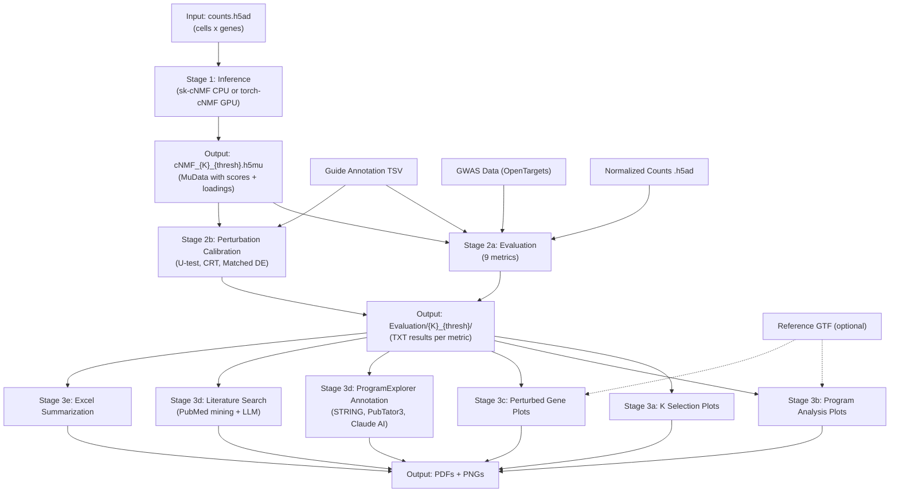

# cNMF Benchmarking Pipeline

## Overview

This pipeline runs consensus Non-negative Matrix Factorization (cNMF) on single-cell perturbation data (CRISPR screens), then evaluates, calibrates, and visualizes the resulting gene programs. It is designed for HPC (SLURM) execution on Stanford's Sherlock cluster.

## Pipeline Structure



## HPC Environment

- **Cluster**: Stanford Sherlock
- **Partitions**: `engreitz`, `owners`, `bigmem`
- **User email**: `ymo@stanford.edu`
- **Pipeline root**: `/oak/stanford/groups/engreitz/Users/ymo/Tools/PerturbNMF`
- **Conda base**: `/oak/stanford/groups/engreitz/Users/ymo/miniforge3`

## Conda Environments

| Environment | Used By |
|-------------|---------|
| `sk-cNMF` | sk-cNMF inference |
| `torch-cNMF` | torch-cNMF inference, K-selection plotting |
| `NMF_Benchmarking` | Evaluation, program analysis plotting, perturbed gene plotting, U-test calibration |
| `programDE` | CRT calibration |

## Conda Activation Pattern

Every Bash command needing a conda environment must use:
```bash
eval "$(conda shell.bash hook)" && conda activate <env_name> && <command>
```

## Key Resource Paths

- **GWAS data**: `/oak/stanford/groups/engreitz/Users/ymo/Tools/PerturbNMF/src/Stage2_Evaluation/Resources/OpenTargets_L2G_Filtered.csv.gz`
- **Reference GTF (IGVF)**: `/oak/stanford/groups/engreitz/Users/opushkar/genome/IGVFFI9573KOZR.gtf.gz`
- **Motif file**: `/oak/stanford/groups/engreitz/Users/ymo/Tools/PerturbNMF/src/Stage2_Evaluation/Resources/hocomoco_meme.meme`
- **Genome sequence**: `/oak/stanford/groups/engreitz/Users/ymo/Tools/PerturbNMF/src/Stage2_Evaluation/Resources/hg38.fa`

## Conventions

- **Run naming**: `MMDDYY_<description>` (e.g., `030526_100k_cells_100iter_allHVG_torch_halsvar_batch_e7_50`)
- **Output structure**: `<out_dir>/<run_name>/` with stage subdirectories: `Inference/` (cnmf_tmp/, adata/, loading/, prog_data/, Annotation/), `Evaluation/` (per-K results)
- **Log directories**: `<out_dir>/<run_name>/Inference/logs/` for inference, `<out_dir>/<run_name>/Evaluation/logs/` for evaluation, `<out_dir>/<run_name>/Plots/logs/` for interpretation
- **Config saving**: Each job saves its config to `config_<SLURM_JOB_ID>.yml`

## Interactive Skill

Use the `perturbNMF-runner` skill (say "run PerturbNMF", "run cNMF", "submit inference", etc.) for guided, interactive pipeline execution. It validates data, recommends SLURM resources, generates scripts, and submits jobs.
