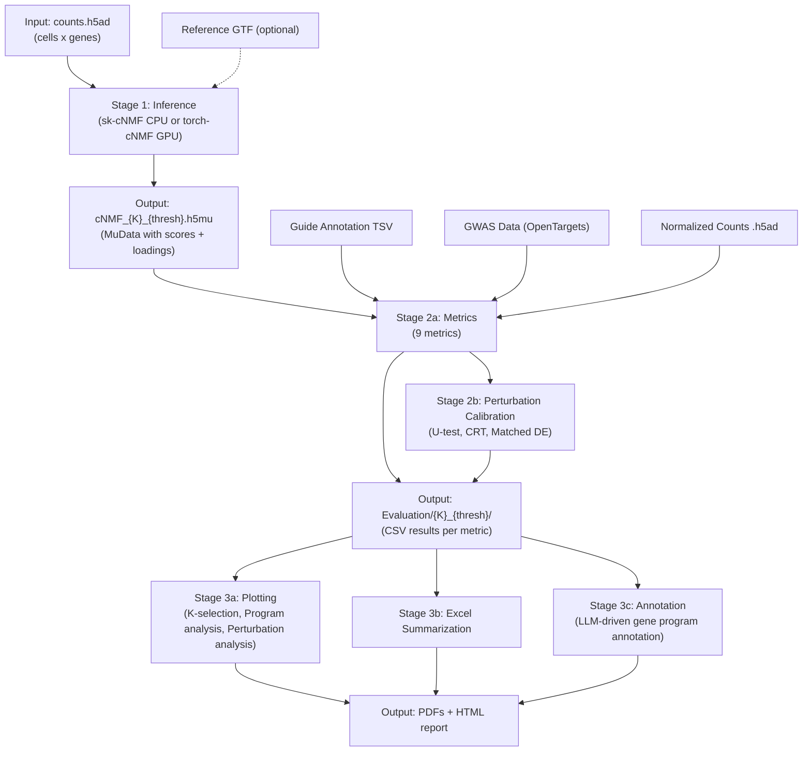

# cNMF Benchmarking Pipeline

## Overview

This pipeline runs consensus Non-negative Matrix Factorization (cNMF) on single-cell perturbation data (CRISPR screens), then evaluates, calibrates, and visualizes the resulting gene programs. It is designed for HPC (SLURM) execution on Stanford's Sherlock cluster.

## Pipeline Structure


```mermaid
flowchart TD
    A["Input: counts.h5ad\n(cells x genes)"] --> B["Stage 1: Inference\n(sk-cNMF CPU or torch-cNMF GPU)"]
    B --> D["Output: cNMF_{K}_{thresh}.h5mu\n(MuData with scores + loadings)"]
    D --> E["Stage 2a: Metrics\n(9 metrics)"]
    E --> F["Output: Evaluation/{K}_{thresh}/\n(CSV results per metric)"]
    E --> G["Stage 2b: Perturbation Calibration\n(U-test, CRT, Matched DE)"]
    G --> F
    F --> I["Stage 3a: Plotting\n(K-selection, Program analysis, Perturbation analysis)"]
    I --> L["Output: PDFs + HTML report"]
    F --> S["Stage 3b: Excel Summarization"]
    S --> L
    F --> Q["Stage 3c: Annotation\n(LLM-driven gene program annotation)"]
    Q --> L
    M["Guide Annotation TSV"] --> E
    N["GWAS Data (OpenTargets)"] --> E
    O["Normalized Counts .h5ad"] --> E
    P["Reference GTF (optional)"] -.-> B
```

## HPC Environment

- **Cluster**: Stanford Sherlock
- **Partitions**: `engreitz`, `owners`, `bigmem`
- **User email**: `ymo@stanford.edu`
- **Pipeline root**: `/oak/stanford/groups/engreitz/Users/ymo/Tools/PerturbNMF`
- **Conda base**: `/oak/stanford/groups/engreitz/Users/ymo/miniforge3`

## Conda Environments

| Environment | Used By |
|-------------|---------|
| `sk-cNMF` | sk-cNMF inference |
| `torch-nmf-dl` | torch-cNMF inference, K-selection plotting |
| `NMF_Benchmarking` | Evaluation, program analysis plotting, perturbed gene plotting, U-test calibration |
| `programDE` | CRT calibration |

## Conda Activation Pattern

Every Bash command needing a conda environment must use:
```bash
eval "$(conda shell.bash hook)" && conda activate <env_name> && <command>
```

## Key Resource Paths

- **GWAS data**: `/oak/stanford/groups/engreitz/Users/ymo/Tools/PerturbNMF/src/Stage2_Evaluation/Resources/OpenTargets_L2G_Filtered.csv.gz`
- **Reference GTF (IGVF)**: `/oak/stanford/groups/engreitz/Users/opushkar/genome/IGVFFI9573KOZR.gtf.gz`
- **Motif file**: `/oak/stanford/groups/engreitz/Users/ymo/Tools/PerturbNMF/src/Stage2_Evaluation/Resources/hocomoco_meme.meme`
- **Genome sequence**: `/oak/stanford/groups/engreitz/Users/ymo/Tools/PerturbNMF/src/Stage2_Evaluation/Resources/hg38.fa`

## Conventions

- **Run naming**: `MMDDYY_<description>` (e.g., `030526_100k_cells_100iter_allHVG_torch_halsvar_batch_e7_50`)
- **Output structure**: `<out_dir>/<run_name>/` with stage subdirectories: `Inference/` (cnmf_tmp/, adata/, loading/, prog_data/, Annotation/), `Evaluation/` (per-K results)
- **Log directories**: `<out_dir>/<run_name>/Inference/logs/` for inference, `<out_dir>/<run_name>/Evaluation/logs/` for evaluation, `<out_dir>/<run_name>/Plots/logs/` for interpretation
- **Config saving**: Each job saves its config to `config_<SLURM_JOB_ID>.yml`

## Claude Code Skills

Four skills under `.claude/skills/`. The `description:` frontmatter in each `SKILL.md` lists trigger phrases.

| Skill | When to use | Detailed docs |
|---|---|---|
| `perturbNMF-runner` | "run PerturbNMF", "run cNMF", "submit inference" — guided pipeline execution with SLURM script generation. | [`.claude/skills/perturbNMF-runner/SKILL.md`](.claude/skills/perturbNMF-runner/SKILL.md) (+ `references/`) |
| `run-tests` | "run tests", "test the pipeline" — end-to-end test suite (sk-cNMF + torch-cNMF + evaluation). | [`.claude/skills/run-tests/SKILL.md`](.claude/skills/run-tests/SKILL.md) |
| `h5mu-structure` | "inspect this h5mu", "structure of this MuData" — emits a tree-format structure summary `.txt`. | [`.claude/skills/h5mu-structure/SKILL.md`](.claude/skills/h5mu-structure/SKILL.md) |
| `pipeline-drift-check` | "check drift", "are the docs in sync" — cross-checks argparse vs READMEs / `.sh` / skill markdown. Run on demand mid-session (a SessionStart hook also runs this automatically at every session start). | [`.claude/skills/pipeline-drift-check/SKILL.md`](.claude/skills/pipeline-drift-check/SKILL.md) |
