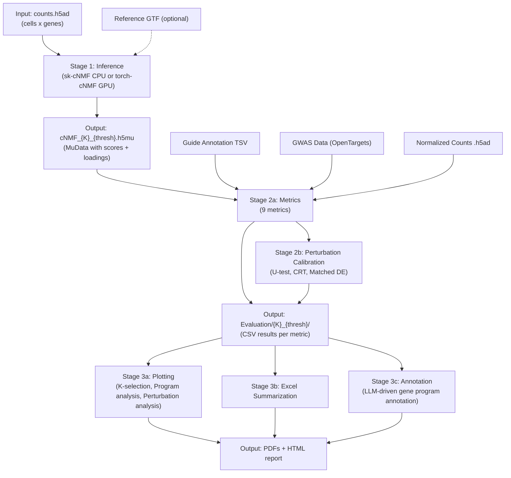

# cNMF Benchmarking Pipeline

## Overview

This pipeline runs consensus Non-negative Matrix Factorization (cNMF) on single-cell perturbation data (CRISPR screens), then evaluates, calibrates, and visualizes the resulting gene programs. It runs on a single machine; the SLURM runner scripts in this repo are optional examples for an HPC cluster and must be configured for yours.

## Public repository — no project-specific content

This repo is **public**. Nothing project-specific may be checked in:

- No dataset, cell-line, screen, or study names, and no dated run directories (e.g. `MMDDYY_<study>_...`).
- No collaborator or personal names, emails, or usernames in runnable code or docs (authorship metadata in `CITATION.cff`, `.zenodo.json`, `CHANGELOG.md`, and README fork links is fine).
- No lab- or cluster-specific paths (group storage mounts, cluster scratch variables, home dirs) and no cluster-specific partitions/accounts. Use placeholders (`/path/to/...`, `<partition>`, `<your_email>`) or env vars (`PIPELINE_ROOT`, `SLURM_PARTITION`, `SLURM_MAIL_USER`).
- Study analyses, worklogs, run reports, and generated outputs belong in a **private** repo, not here. Never commit `tasks/` or `.baton/` (both gitignored).
- Before committing, run the guard: `python3 tools/check_no_lab_specific_content.py` (CI runs it on every push/PR; `pre-commit install` runs it on staged changes). If a hit is legitimate, add it to `tools/lab_specific_allowlist.txt` with a comment explaining why.

## Pipeline Structure


```mermaid
flowchart TD
    A["Input: counts.h5ad\n(cells x genes)"] --> B["Stage 1: Inference\n(sk-cNMF CPU or torch-cNMF GPU)"]
    B --> D["Output: cNMF_{K}_{thresh}.h5mu\n(MuData with scores + loadings)"]
    D --> E["Stage 2a: Metrics\n(9 metrics)"]
    E --> F["Output: Evaluation/{K}_{thresh}/\n(CSV results per metric)"]
    E --> G["Stage 2b: Perturbation Calibration\n(U-test, CRT, Matched DE)"]
    G --> F
    F --> I["Stage 3a: Plotting\n(K-selection, Program analysis, Perturbation analysis)"]
    I --> L["Output: PDFs + HTML report"]
    F --> S["Stage 3b: Excel Summarization"]
    S --> L
    F --> Q["Stage 3c: Annotation\n(LLM-driven gene program annotation)"]
    Q --> L
    M["Guide Annotation TSV"] --> E
    N["GWAS Data (OpenTargets)"] --> E
    O["Normalized Counts .h5ad"] --> E
    P["Reference GTF (optional)"] -.-> B
```

## HPC Environment (optional)

Site-specific settings are supplied by the user, never hardcoded:

- **Pipeline root**: `export PIPELINE_ROOT=/path/to/PerturbNMF` (required by the SLURM runner scripts)
- **Partition / email**: edit the `<partition>` / `<your_email>` placeholders in the `.sh` runners, or pass `--partition` / `--email` (or set `SLURM_PARTITION` / `SLURM_MAIL_USER`) to the runner skill's `generate_slurm.py`
- **Conda**: activate via `eval "$(conda shell.bash hook)"` (no hardcoded conda base)

## Conda Environments

| Environment | Used By |
|-------------|---------|
| `sk-cNMF` | sk-cNMF inference |
| `torch-nmf-dl` | torch-cNMF inference, K-selection plotting |
| `NMF_Benchmarking` | Evaluation, program analysis plotting, perturbed gene plotting, U-test calibration, CRT calibration |
| `programDE` | Matched Cell DE (R) |

## Conda Activation Pattern

Every Bash command needing a conda environment must use:
```bash
eval "$(conda shell.bash hook)" && conda activate <env_name> && <command>
```

## Key Resource Paths

Reference data lives in `src/Stage2_Evaluation/Resources/` (not tracked; populate it with `setup_resources.sh`):

- **GWAS data**: `Resources/OpenTargets_L2G_Filtered.csv.gz`
- **Motif file**: `Resources/hocomoco_meme.meme`
- **Genome sequence**: `Resources/hg38.fa`
- **Reference GTF (optional)**: user-supplied (e.g. a GENCODE `.gtf.gz`), passed via `--gtf_path` / `--reference_gtf_path`

## Conventions

- **Run naming**: `MMDDYY_<description>` (e.g., `010125_100k_cells_torch_halsvar_K50`)
- **Output structure**: `<out_dir>/<run_name>/` with stage subdirectories: `Inference/` (cnmf_tmp/, adata/, loading/, prog_data/, Annotation/), `Evaluation/` (per-K results)
- **Log directories**: `<out_dir>/<run_name>/Inference/logs/` for inference, `<out_dir>/<run_name>/Evaluation/logs/` for evaluation, `<out_dir>/<run_name>/Plots/logs/` for interpretation
- **Config saving**: Each job saves its config to `config_<SLURM_JOB_ID>.yml`

## Claude Code Skills

Four skills under `.claude/skills/`. The `description:` frontmatter in each `SKILL.md` lists trigger phrases.

| Skill | When to use | Detailed docs |
|---|---|---|
| `perturbNMF-runner` | "run PerturbNMF", "run cNMF", "submit inference" — guided pipeline execution with SLURM script generation. | [`.claude/skills/perturbNMF-runner/SKILL.md`](.claude/skills/perturbNMF-runner/SKILL.md) (+ `references/`) |
| `run-tests` | "run tests", "test the pipeline" — end-to-end test suite (sk-cNMF + torch-cNMF + evaluation). | [`.claude/skills/run-tests/SKILL.md`](.claude/skills/run-tests/SKILL.md) |
| `h5mu-structure` | "inspect this h5mu", "structure of this MuData" — emits a tree-format structure summary `.txt`. | [`.claude/skills/h5mu-structure/SKILL.md`](.claude/skills/h5mu-structure/SKILL.md) |
| `pipeline-drift-check` | "check drift", "are the docs in sync" — cross-checks argparse vs READMEs / `.sh` / skill markdown. Run on demand mid-session (a SessionStart hook also runs this automatically at every session start). | [`.claude/skills/pipeline-drift-check/SKILL.md`](.claude/skills/pipeline-drift-check/SKILL.md) |
