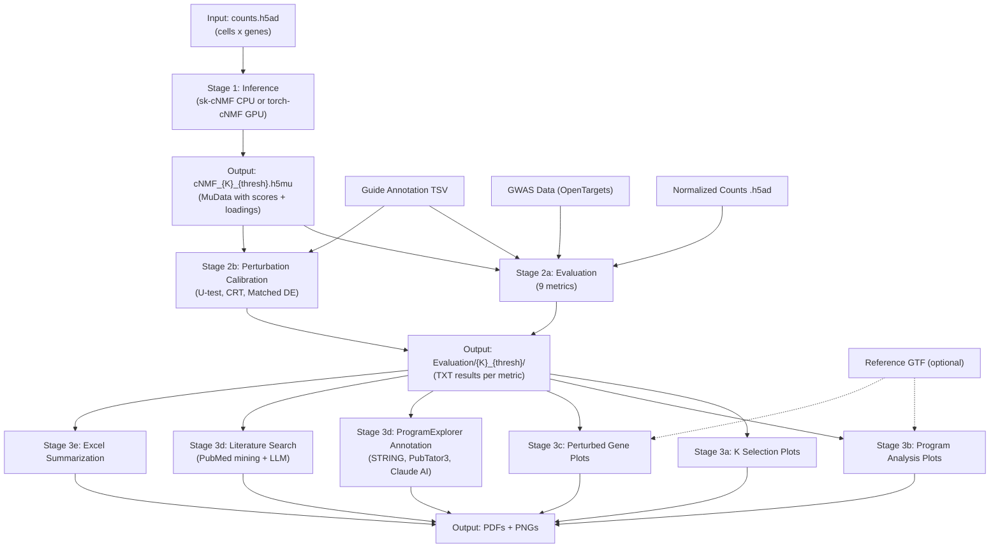

# cNMF Pipeline

Detail requirement see: https://docs.google.com/document/d/1eusT8lUCeKl1lTkQ37qd8IoRy3P1798lSVOkpPbyGMU/edit?usp=sharing

## Overview
End-to-end pipeline for running and evaluating (with visualization) consensus Non-negative Matrix Factorization (cNMF) on single-cell data with perturbation.

## Components

### Stage 1: Inference
Run cNMF to decompose the cell × gene matrix into gene programs. Pick one:
- **sk-cNMF**: CPU-based implementation using scikit-learn
- **torch-cNMF**: GPU-accelerated implementation using PyTorch

See [`src/Stage1_Inference/README.md`](src/Stage1_Inference/README.md) for detailed usage and recommended K selection steps.

### Stage 2: Evaluation
Evaluate the quality of inferred gene programs using comprehensive metrics, with perturbation calibration as part of the evaluation process.

**Evaluation metrics:**
- Categorical association analysis
- Perturbation sensitivity testing (default U-test)
- Motif enrichment
- Trait enrichment analysis (GWAS/OpenTargets)
- GO geneset enrichment analysis
- geneset enrichment analysis
- Explained variance calculation
- Reconstruction error
- Stability metrics

See [`src/Stage2_Evaluation/A_Metrics/README.md`](src/Stage2_Evaluation/A_Metrics/README.md) for detailed parameters and output format.

**Perturbation calibration** (pick one method):
- **U-test**: Fast, non-parametric — good for initial exploratory analysis
- **CRT**: Permutation-based, covariate-adjusted — more statistically rigorous
- **Matched Cell DE**: Propensity score matching with G-computation — causal inference framework

Calibration validates that p-value calculations are well-calibrated by generating a null distribution from non-targeting guides:
1. Generate fake p-values by randomly selecting non-targeting guides as targeting, then perform perturbation testing
2. The fake p-values vs uniform distribution QQ-plot should align on the diagonal
3. The real p-values vs uniform distribution QQ-plot should show enrichment (rarer than expected)
4. If calibrated → proceed to downstream analysis. If not → change the p-value calculation method.

See [`src/Stage2_Evaluation/B_Calibration/README.md`](src/Stage2_Evaluation/B_Calibration/README.md) for detailed method descriptions and guidance on choosing a test.

### Stage 3: Interpretation
- **K-selection plots** for optimal K selection
- **Program analysis plots** for per-program quality control
- **Perturbed gene analysis** visualization
- **ProgramExplorer annotation**: LLM-driven gene program annotation (STRING enrichment, PubTator3 literature mining, Claude AI)
- **Literature search**: PubMed-based literature mining with LLM verification
- **Excel summarization** of results

See [`src/Stage3_Interpretation/README.md`](src/Stage3_Interpretation/README.md) for detailed parameters and output format.
