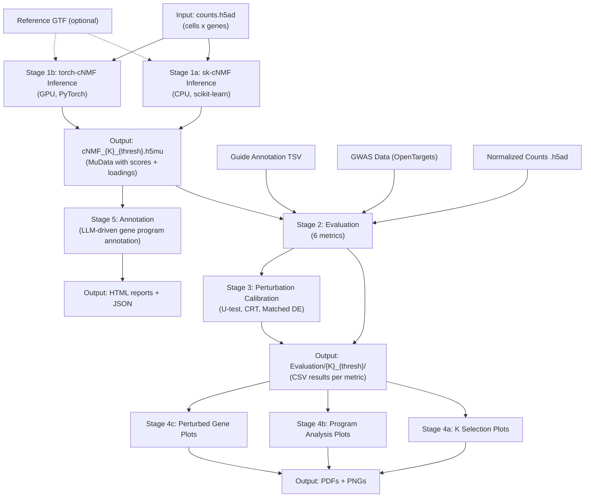

# cNMF Pipeline

Detail requirement see: https://docs.google.com/document/d/1eusT8lUCeKl1lTkQ37qd8IoRy3P1798lSVOkpPbyGMU/edit?usp=sharing

## Overview
End-to-end pipeline for running and evaluating (with visualization) consensus Non-negative Matrix Factorization (cNMF) on single-cell data with perturbation.

## Components

### Inference
- **sk-cNMF**: CPU-based implementation using scikit-learn
- **torch-cNMF**: GPU-accelerated implementation using PyTorch

### Perturbation calibration
- For each dataset, perform a calibration test to generate a null distribution with non-targeting guides, and test if the p-value calculation is well calibrated. 
    - generate fake p-values by randomly selecting some non-targeting guides to be targeting, perform a perturbation test. 
    - the fake p-values vs uniform p-value distribution qqplot, the fake p-values need to be aligned in diagonal 
    - Then, the real p-values vs the uniform p-value distribution qqplot, the real p-values need to be rarer
		1. If pass, proceed to downstream analysis 
		2. If failed, change the p-value calculation method

### Evaluation
Comprehensive evaluation metrics including:
- Categorical association analysis
- Perturbation sensitivity testing (default U-test)
- Motif & geneset enrichment
- Trait enrichment analysis
- GO enrichment analysis
- Genesets enrichment analysis
- Explained variance calculation
- Reconstruction error
- stability metrics

### Interpretation
Quality control and analysis visualization tools:
- K-selection plots for optimal K selection
- Compare Model plots for comparing sk-cNMF vs torch-cNMF results
- Program quality control plots visualization
- Perturbed gene analysis visualization
- Excel summarization of results

### Annotation
LLM-driven gene program annotation pipeline (ported from ProgExplorer). Uses STRING enrichment, PubTator3 literature mining, and Claude AI to generate structured biological annotations for each gene program.

See [`src/Interpretation/README.md`](src/Interpretation/README.md) for detailed usage.

## Usage
1. Run inference using either sk-cNMF or torch-cNMF
2. Perform the perturbation sensitivity test and test if p-values are well calibrated
3. Evaluate results using the evaluation pipeline
4. Generate plots for analysis and quality control and compile results into Excel summary tables
5. (Optional) Run annotation pipeline for LLM-based gene program interpretation

See individual component READMEs for detailed usage instructions.
