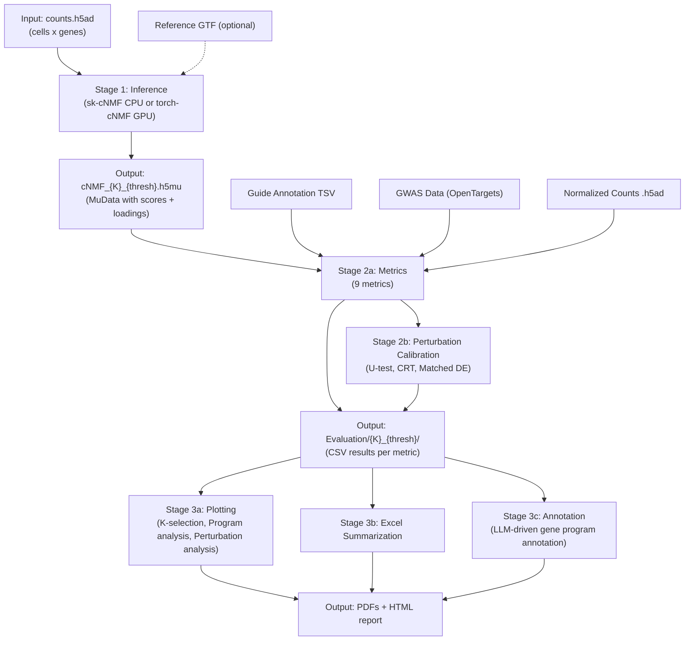

# PerturbNMF Pipeline

```mermaid
flowchart TD
    A["Input: counts.h5ad\n(cells x genes)"] --> B["Stage 1: Inference\n(sk-cNMF CPU or torch-cNMF GPU)"]
    B --> D["Output: cNMF_{K}_{thresh}.h5mu\n(MuData with scores + loadings)"]
    D --> E["Stage 2a: Metrics\n(9 metrics)"]
    E --> F["Output: Evaluation/{K}_{thresh}/\n(CSV results per metric)"]
    E --> G["Stage 2b: Perturbation Calibration\n(U-test, CRT, Matched DE)"]
    G --> F
    F --> I["Stage 3a: Plotting\n(K-selection, Program analysis, Perturbation analysis)"]
    I --> L["Output: PDFs + HTML report"]
    F --> S["Stage 3b: Excel Summarization"]
    S --> L
    F --> Q["Stage 3c: Annotation\n(LLM-driven gene program annotation)"]
    Q --> L
    M["Guide Annotation TSV"] --> E
    N["GWAS Data (OpenTargets)"] --> E
    O["Normalized Counts .h5ad"] --> E
    P["Reference GTF (optional)"] -.-> B
```

## 📖 Detailed user guide

Full reference doc (Google Docs):
**https://docs.google.com/document/d/1eusT8lUCeKl1lTkQ37qd8IoRy3P1798lSVOkpPbyGMU/edit?usp=sharing**

The linked doc covers, in depth:

- **Required input data format for every step** — `.h5ad` schema (obs, var, X), MuData (`.h5mu`) modalities, guide annotation TSV layout, GWAS reference, motif reference, GTF reference, and which keys (`guide_assignment`, `guide_targets`, `categorical_key`, etc.) are required at each stage.
- **How to run the pipeline end-to-end** — concrete invocations of each SLURM `.sh`, expected output paths, recommended resource requests, and how the stages chain together.
- **How to choose K (number of programs)** — interpretation of the 8-panel K-selection plot, the saturation-elbow rule, and what to do when panels disagree. See also the quick-reference [`examples/Interpretation/README.md`](examples/Interpretation/README.md).
- **How to choose density threshold (`sel_thresh`)** — interpretation of `Inference.density_filtering.dt_<X>.png`, trade-offs between strict filtering (fewer but more reproducible programs) and lax filtering (more programs, more noise), and how survival rate scales with K.

If anything in this top-level README is ambiguous, the doc above is the authoritative source.

## Overview
End-to-end pipeline for running and evaluating (with visualization) consensus Non-negative Matrix Factorization (cNMF) on single-cell data with perturbation.

## Components

### Stage 1: Inference
Run cNMF to decompose the cell × gene matrix into gene programs. Pick one:
- **sk-cNMF**: CPU-based implementation using scikit-learn
- **torch-cNMF**: GPU-accelerated implementation using PyTorch

See [`src/Stage1_Inference/README.md`](src/Stage1_Inference/README.md) for detailed usage and recommended K selection steps.

### Stage 2: Evaluation
Evaluate the quality of inferred gene programs using comprehensive metrics, with perturbation calibration as part of the evaluation process.

**Evaluation metrics:**
- Categorical association analysis
- Perturbation sensitivity testing (default U-test)
- Motif enrichment
- Trait enrichment analysis (GWAS/OpenTargets)
- GO geneset enrichment analysis
- geneset enrichment analysis
- Explained variance calculation
- Reconstruction error
- Stability metrics

See [`src/Stage2_Evaluation/A_Metrics/README.md`](src/Stage2_Evaluation/A_Metrics/README.md) for detailed parameters and output format.

**Perturbation calibration** (pick one method):
- **U-test**: Fast, non-parametric — good for initial exploratory analysis
- **CRT**: Permutation-based, covariate-adjusted — more statistically rigorous
- **Matched Cell DE**:  Permutation-based, covariate-adjusted — more statistically rigorous

Calibration validates that p-value calculations are well-calibrated by generating a null distribution from non-targeting guides:
1. Generate fake p-values by randomly selecting non-targeting guides as targeting, then perform perturbation testing
2. The fake p-values vs uniform distribution QQ-plot should align on the diagonal
3. The real p-values vs uniform distribution QQ-plot should show enrichment (rarer than expected)
4. If calibrated → proceed to downstream analysis. If not → change the p-value calculation method or use different covariate.

See [`src/Stage2_Evaluation/B_Calibration/README.md`](src/Stage2_Evaluation/B_Calibration/README.md) for detailed method descriptions and guidance on choosing a test.

### Stage 3: Interpretation
- **K-selection plots** for optimal K selection
- **Program  plots** for per-program quality control
- **Perturbation plots** visualization
- **Excel summarization** of results
- **Annotation**: LLM-driven gene program annotation (PubTator3 literature mining, verfiication of LLM generated contents)

See [`src/Stage3_Interpretation/README.md`](src/Stage3_Interpretation/README.md) for detailed parameters and output format.

## Claude Code Skills

This repo ships four Claude Code skills under `.claude/skills/` for guided pipeline execution, validation, and maintenance. Open the linked `SKILL.md` for trigger phrases, detailed usage, and helper script references.

| Skill | What it does | Detailed docs |
|---|---|---|
| **perturbNMF-runner** | Interactive runner for the full pipeline (inference → evaluation → calibration → plotting → annotation → Excel summary). Validates input data, recommends SLURM resources, generates and submits scripts. | [`.claude/skills/perturbNMF-runner/SKILL.md`](.claude/skills/perturbNMF-runner/SKILL.md) — see also `references/01-inference.md` … `05-annotation-summary.md`, `parameter-catalog.md`, `data-format-spec.md` |
| **run-tests** | Runs the end-to-end test suite: clean previous outputs, submit sk-cNMF (CPU) and torch-cNMF (GPU/SLURM) inference tests, then evaluation tests, and summarizes pass/fail. | [`.claude/skills/run-tests/SKILL.md`](.claude/skills/run-tests/SKILL.md) |
| **h5mu-structure** | Inspects an `.h5mu` file and emits a tree-format `.txt` summary listing modalities, `obs`/`var`/`uns`/`obsm`/`layers` keys. | [`.claude/skills/h5mu-structure/SKILL.md`](.claude/skills/h5mu-structure/SKILL.md) |
| **pipeline-drift-check** | Detects parameter drift between `add_argument` calls in `src/**/*.py` (and `make_option` in `.R`) and the `--flag` mentions in sibling READMEs, SLURM `.sh` runners, and skill markdown. Run after editing any argparse or doc. | [`.claude/skills/pipeline-drift-check/SKILL.md`](.claude/skills/pipeline-drift-check/SKILL.md) |
