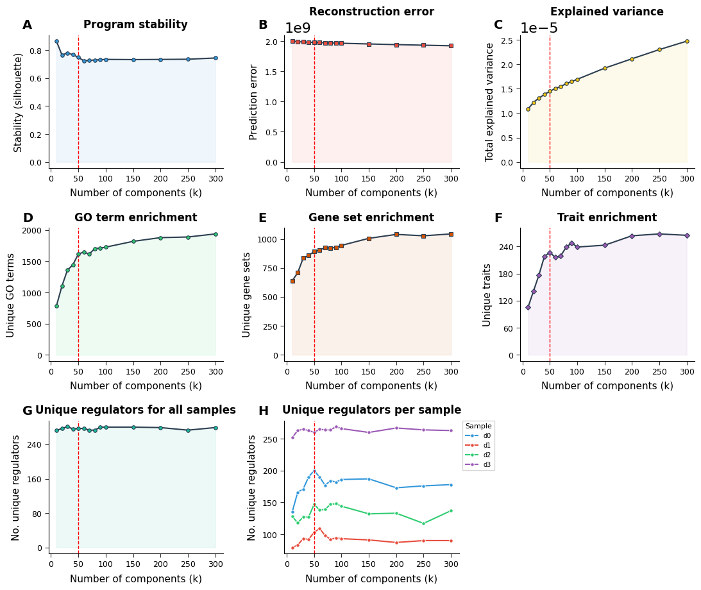

# How to choose K

**Rule:** the saturation of the curves serves as a proxy for whether all signal
has been captured. **Pick the K at the turning point** where the curves
plateau — adding more programs after that yields diminishing returns.

In the example above the elbow is at **K = 50** (red dashed line).

## Reading the panels

- **A. Program stability** — should be high and flat at chosen K
- **B. Reconstruction error / C. Explained variance** — keep improving with K; look for the *knee*, not the maximum
- **D. GO terms / E. Gene sets / F. Traits** — count of unique biology captured; plateau means no new themes
- **G. Unique regulators (all) / H. Unique regulators (per sample)** — regulatory vocabulary recovered

Trust panels that agree. Lean on **A, D, E** over B, C (the latter trend monotonically and can mislead).

## Picking K

1. Run a broad K sweep (e.g. `K=[10, 30, 50, 80, 100, 150, 200, 250, 300]`).
2. Generate this plot.
3. Find the elbow on each panel; pick K where most panels agree.
4. Cross-check with `Inference.density_filtering.dt_<X>.png` — if survival rate has collapsed at your K, pick smaller.

## Pitfalls

- Don't maximize explained variance (Panel C) — it keeps climbing forever.
- Don't maximize stability (Panel A) — it's often highest at trivially small K.
- If all panels are still rising at your largest K, extend the sweep upward before deciding.
