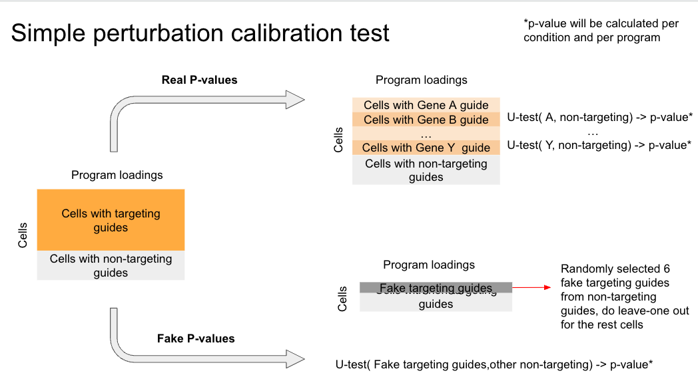

# U-test Perturbation Calibration

## Overview
This Python pipeline performs Mann-Whitney U-test on program scores to identify regulators for programs and generates null p-values from non-targeting/safe-targeting guides for calibration. Environment file is not provided because only basic packages are needed.

## Parameters

### Required Parameters

| Parameter | Type | Description |
|-----------|------|-------------|
| out_dir | str | Directory containing cNMF output files |
| run_name | str | Name of the cNMF run (must match name used during inference) |
| mdata_guide_path | str | Path to MuData object (.h5mu) containing guide assignment information |

### Optional Parameters

| Parameter | Type | Default | Description |
|-----------|------|---------|-------------|
| components | list of int | [30, 50, 60, 80, 100, 200, 250, 300] | K values (number of components) to test |
| sel_thresh | list of float | [0.4, 0.8, 2.0] | Density threshold values for consensus selection |
| guide_annotation_path | str | None | Path to tab-separated file with guide annotations including "targeting" column (True/False) |
| guide_annotation_key | str | ["non-targeting"] | Name of target label for non-targeting/safe-targeting guides |
| organism | str | "human" | Organism/species for analysis |
| FDR_method | str | "StoreyQ" | FDR correction method for perturbation tests |

### Data Access Keys

| Parameter | Type | Default | Description |
|-----------|------|---------|-------------|
| data_key | str | "rna" | Gene expression access key |
| prog_key | str | "cNMF" | cNMF program access key |
| categorical_key | str | "sample" | Cell condition key |
| guide_names_key | str | "guide_names" | Guide names key |
| guide_targets_key | str | "guide_targets" | Guide targets key |
| guide_assignment_key | str | "guide_assignment" | Guide assignment key |

### Calibration Parameters

| Parameter | Type | Default | Description |
|-----------|------|---------|-------------|
| number_run | int | 300 | Number of calibration iterations with randomly selected fake targeting guides |
| number_guide | int | 6 | Number of non-targeting guides to randomly designate as "targeting" per iteration |

### Analysis Flags

| Flag | Description |
|------|-------------|
| --compute_real_perturbation_tests | Compute perturbation association tests on real targeting guides |
| --compute_fake_perturbation_tests | Compute perturbation association tests on fake targeting guides (calibration null) |
| --visualizations | Generate QQ plots and violin plots comparing real vs null distributions |
